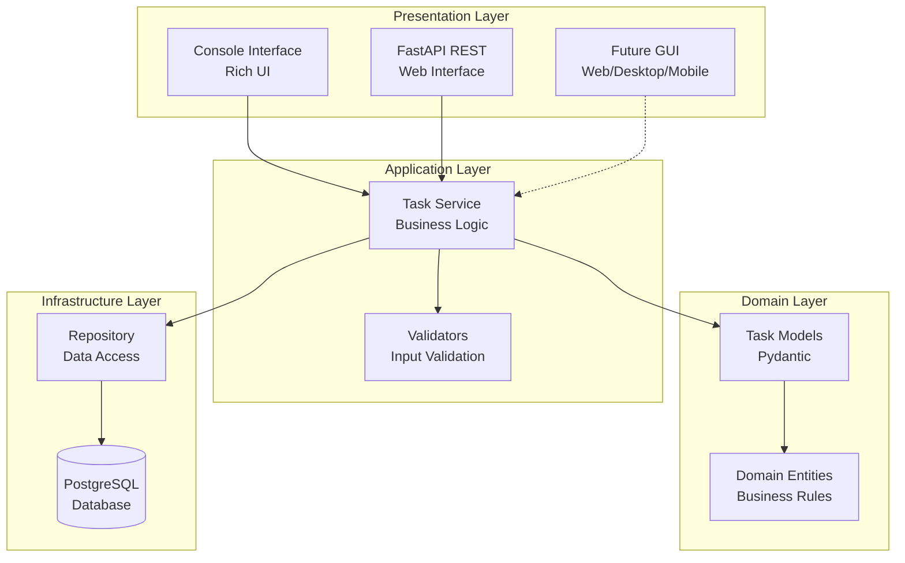
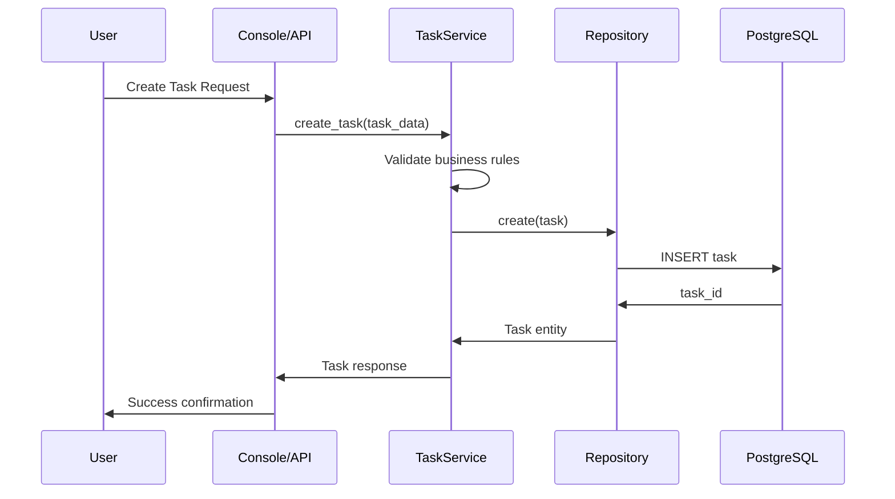
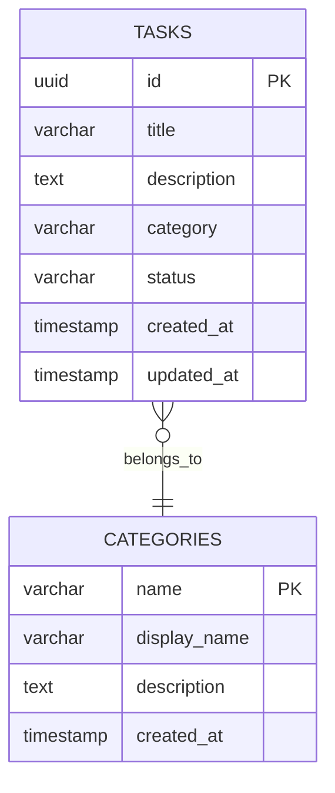

# TODO Application - Product Requirements Document (PRD)

## 1. Executive Summary

### Vision
Create a modern, extensible TODO application using Test-Driven Development (TDD) that serves general users through multiple interfaces while maintaining a clean, scalable architecture.

### Core Value Proposition
- **TDD-first development** ensuring robust, tested code
- **Multi-interface support** (Console with Rich UI + FastAPI REST)
- **Extensible architecture** for future GUI implementations
- **Simple yet powerful** task management for everyday users

### Key Differentiators
- Clean architecture with clear separation of concerns
- Rich console interface for power users
- RESTful API for integration possibilities
- Built for extension (web UI, desktop, mobile ready)

## 2. Problem & Solution

### Problem Statement
General users need a reliable, simple task management system that:
- Works across different interfaces (console, API, future GUI)
- Provides essential task organization (categories, filtering)
- Is built with quality code practices (TDD)
- Can evolve with changing needs

### Solution Overview
A Python-based TODO application with:
- **Core Domain Layer**: Business logic independent of UI
- **Console Interface**: Rich terminal experience
- **REST API**: FastAPI-powered web interface
- **Extensible Architecture**: Ready for any GUI framework

## 3. User Stories & Workflows

### Epic 1: Core Task Management

#### Story 1.1: Create Tasks
**As a** general user  
**I want** to create new tasks with titles and descriptions  
**So that** I can capture things I need to do  

**Acceptance Criteria:**
- [ ] Task must have a non-empty title
- [ ] Description is optional
- [ ] Task gets unique ID and creation timestamp
- [ ] Task defaults to "pending" status

#### Story 1.2: View Tasks
**As a** general user  
**I want** to view my tasks in different ways  
**So that** I can see what needs to be done  

**Acceptance Criteria:**
- [ ] List all tasks
- [ ] Filter by status (pending/completed)
- [ ] Filter by category
- [ ] Sort by creation date, due date, or priority

#### Story 1.3: Update Tasks
**As a** general user  
**I want** to edit task details  
**So that** I can keep information current  

**Acceptance Criteria:**
- [ ] Modify title, description, category
- [ ] Change status (pending ↔ completed)
- [ ] Update timestamps automatically

#### Story 1.4: Delete Tasks
**As a** general user  
**I want** to delete tasks I no longer need  
**So that** my list stays clean  

**Acceptance Criteria:**
- [ ] Permanently remove tasks
- [ ] Confirm deletion for safety
- [ ] Cannot recover deleted tasks

### Epic 2: Organization Features

#### Story 2.1: Categorize Tasks
**As a** general user  
**I want** to assign categories to tasks  
**So that** I can organize them by context  

**Acceptance Criteria:**
- [ ] Create custom categories
- [ ] Assign categories to tasks
- [ ] Filter tasks by category
- [ ] Default "General" category

#### Story 2.2: Filter Completed Tasks
**As a** general user  
**I want** to filter completed tasks  
**So that** I can focus on pending work  

**Acceptance Criteria:**
- [ ] Show only pending tasks
- [ ] Show only completed tasks  
- [ ] Show all tasks (default)

### Epic 3: Interface Access

#### Story 3.1: Console Interface
**As a** power user  
**I want** a rich console interface  
**So that** I can manage tasks efficiently from terminal  

**Acceptance Criteria:**
- [ ] Rich formatting and colors
- [ ] Interactive menus
- [ ] Keyboard shortcuts
- [ ] Clear visual feedback

#### Story 3.2: API Access
**As a** developer/integrator  
**I want** REST API endpoints  
**So that** I can integrate with other systems  

**Acceptance Criteria:**
- [ ] Full CRUD operations via HTTP
- [ ] JSON request/response format
- [ ] Automatic API documentation
- [ ] Consistent error handling

## 4. Technical Architecture

### Architecture Overview



### System Components

#### 1. Domain Layer (Core Business Logic)
```python
# src/todo_app/domain/models.py
class Task(BaseModel):
    id: UUID
    title: str
    description: Optional[str]
    category: str = "General"
    status: TaskStatus = TaskStatus.PENDING
    created_at: datetime
    updated_at: datetime
```

#### 2. Repository Pattern (Data Access)
```python
# src/todo_app/infrastructure/repository.py
class TaskRepository(Protocol):
    async def create(self, task: TaskCreate) -> Task: ...
    async def get_by_id(self, task_id: UUID) -> Optional[Task]: ...
    async def list_all(self, filters: TaskFilters) -> List[Task]: ...
    async def update(self, task_id: UUID, updates: TaskUpdate) -> Task: ...
    async def delete(self, task_id: UUID) -> bool: ...
```

#### 3. Service Layer (Business Operations)
```python
# src/todo_app/services/task_service.py
class TaskService:
    def __init__(self, repository: TaskRepository):
        self.repository = repository
    
    async def create_task(self, task_data: TaskCreate) -> Task: ...
    async def get_filtered_tasks(self, filters: TaskFilters) -> List[Task]: ...
```

### Data Flow Diagram



## 5. API Specifications

### REST Endpoints

#### Tasks Resource
```http
GET    /api/v1/tasks              # List tasks with filters
POST   /api/v1/tasks              # Create new task
GET    /api/v1/tasks/{task_id}    # Get specific task
PUT    /api/v1/tasks/{task_id}    # Update task
DELETE /api/v1/tasks/{task_id}    # Delete task
```

#### Categories Resource
```http
GET    /api/v1/categories         # List all categories
POST   /api/v1/categories         # Create category
```

### Request/Response Examples

#### Create Task
```http
POST /api/v1/tasks
Content-Type: application/json

{
    "title": "Buy groceries",
    "description": "Milk, bread, eggs",
    "category": "Personal"
}
```

```http
HTTP/1.1 201 Created
Content-Type: application/json

{
    "id": "550e8400-e29b-41d4-a716-446655440000",
    "title": "Buy groceries",
    "description": "Milk, bread, eggs",
    "category": "Personal",
    "status": "pending",
    "created_at": "2025-01-15T10:30:00Z",
    "updated_at": "2025-01-15T10:30:00Z"
}
```

#### List Tasks with Filters
```http
GET /api/v1/tasks?status=pending&category=Personal&limit=10
```

## 6. Data Models

### Database Schema



### Pydantic Models

```python
class TaskStatus(str, Enum):
    PENDING = "pending"
    COMPLETED = "completed"

class TaskBase(BaseModel):
    title: str = Field(..., min_length=1, max_length=255)
    description: Optional[str] = Field(None, max_length=1000)
    category: str = Field(default="General", max_length=50)

class TaskCreate(TaskBase):
    pass

class TaskUpdate(BaseModel):
    title: Optional[str] = Field(None, min_length=1, max_length=255)
    description: Optional[str] = Field(None, max_length=1000)
    category: Optional[str] = Field(None, max_length=50)
    status: Optional[TaskStatus] = None

class Task(TaskBase):
    id: UUID
    status: TaskStatus = TaskStatus.PENDING
    created_at: datetime
    updated_at: datetime
    
    model_config = ConfigDict(from_attributes=True)
```

## 7. Implementation Phases

### Phase 1: Foundation (Week 1-2)
- [ ] Project setup with UV package management
- [ ] Database schema and migrations
- [ ] Core domain models (Pydantic)
- [ ] Repository pattern implementation
- [ ] Basic unit tests

**Deliverables:**
- Working database layer
- 80%+ test coverage for domain logic
- Basic CRUD operations

### Phase 2: Business Logic (Week 2-3)
- [ ] Task service layer
- [ ] Category management
- [ ] Filtering and search logic
- [ ] Comprehensive test suite
- [ ] Error handling patterns

**Deliverables:**
- Complete business logic layer
- Integration tests
- Service layer documentation

### Phase 3: Console Interface (Week 3-4)
- [ ] Rich console interface
- [ ] Interactive menus
- [ ] Command-line argument parsing
- [ ] Console-specific tests
- [ ] User experience polish

**Deliverables:**
- Fully functional console app
- Rich formatting and interactions
- Console interface tests

### Phase 4: REST API (Week 4-5)
- [ ] FastAPI application setup
- [ ] REST endpoint implementation
- [ ] Request/response validation
- [ ] API documentation (Swagger)
- [ ] API integration tests

**Deliverables:**
- Complete REST API
- Interactive API docs
- Postman/curl examples

### Phase 5: Integration & Polish (Week 5-6)
- [ ] End-to-end testing
- [ ] Performance optimization
- [ ] Documentation completion
- [ ] Deployment preparation
- [ ] Extension point validation

**Deliverables:**
- Production-ready application
- Complete documentation
- Deployment guide

## 8. Risks & Mitigations

### Technical Risks

| Risk | Impact | Probability | Mitigation |
|------|---------|------------|------------|
| Database migration complexity | Medium | Low | Use Alembic for migrations, simple schema |
| Test coverage gaps | High | Medium | TDD approach, coverage monitoring |
| Performance with large datasets | Medium | Medium | Pagination, indexing, query optimization |
| API versioning complexity | Low | Low | Start with v1, plan for backwards compatibility |

### Development Risks

| Risk | Impact | Probability | Mitigation |
|------|---------|------------|------------|
| Over-engineering | Medium | High | YAGNI principle, incremental development |
| Feature creep | Medium | Medium | Strict scope management, MVP focus |
| Testing bottlenecks | High | Low | Parallel test development, CI/CD |

## 9. Success Metrics

### Technical Metrics
- **Test Coverage**: >90% for core business logic
- **API Response Time**: <100ms for basic operations
- **Code Quality**: Ruff/MyPy compliance, no critical issues
- **Architecture**: Clear separation of concerns, <5 dependencies between layers

### User Experience Metrics
- **Console Usability**: <3 steps for common operations
- **API Completeness**: Full CRUD through REST endpoints
- **Error Handling**: Clear, actionable error messages
- **Documentation**: Complete setup and usage guides

### Extensibility Metrics
- **GUI Integration**: New interface in <1 week
- **New Features**: Additional functionality without core changes
- **Database Changes**: Schema evolution without breaking changes

## 10. Future Extension Points

### GUI Framework Options

#### Option 1: Web Frontend (Recommended)
- **Technology**: React/Vue.js + FastAPI
- **Benefits**: Cross-platform, modern UX, easy deployment
- **Timeline**: 2-3 weeks after API completion

#### Option 2: Desktop Application
- **Technology**: PyQt6/Tkinter
- **Benefits**: Native feel, offline-first
- **Timeline**: 3-4 weeks

#### Option 3: Mobile App
- **Technology**: React Native + FastAPI
- **Benefits**: Mobile-first experience
- **Timeline**: 4-6 weeks

### Architecture Extension Points

```python
# Interface for new UI implementations
class TaskInterface(Protocol):
    def display_tasks(self, tasks: List[Task]) -> None: ...
    def get_user_input(self, prompt: str) -> str: ...
    def show_error(self, message: str) -> None: ...
    def show_success(self, message: str) -> None: ...

# Easy to add new interfaces
class WebInterface(TaskInterface): ...
class DesktopInterface(TaskInterface): ...
class MobileInterface(TaskInterface): ...
```

## 11. Technical Dependencies

### Core Dependencies
```toml
[dependencies]
python = "^3.12"
fastapi = "^0.104.0"
uvicorn = "^0.24.0"
pydantic = "^2.5.0"
sqlalchemy = "^2.0.0"
alembic = "^1.13.0"
asyncpg = "^0.29.0"
rich = "^13.7.0"
click = "^8.1.0"

[tool.dev-dependencies]
pytest = "^7.4.0"
pytest-asyncio = "^0.21.0"
pytest-cov = "^4.1.0"
ruff = "^0.1.0"
mypy = "^1.7.0"
pre-commit = "^3.5.0"
```

### Development Tools
- **UV**: Package and environment management
- **Ruff**: Code formatting and linting
- **MyPy**: Static type checking
- **Pytest**: Testing framework with async support
- **Pre-commit**: Git hooks for code quality

## 12. Conclusion

This TODO application represents a modern approach to task management software, emphasizing:

1. **Quality First**: TDD ensures robust, maintainable code
2. **User-Centric**: Multiple interfaces for different use cases
3. **Extensible**: Architecture ready for any future GUI
4. **Simple**: Focus on core functionality without bloat
5. **Modern**: Latest Python practices and tools

The phased approach ensures steady progress while maintaining quality, with each phase building on solid foundations. The extensible architecture means the investment in core business logic pays dividends as new interfaces are added.

**Next Steps**: Begin Phase 1 implementation with project setup and core domain modeling.